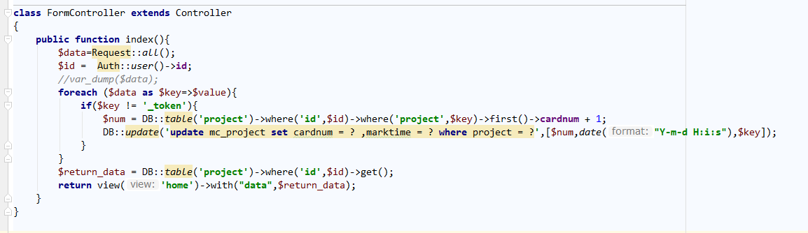
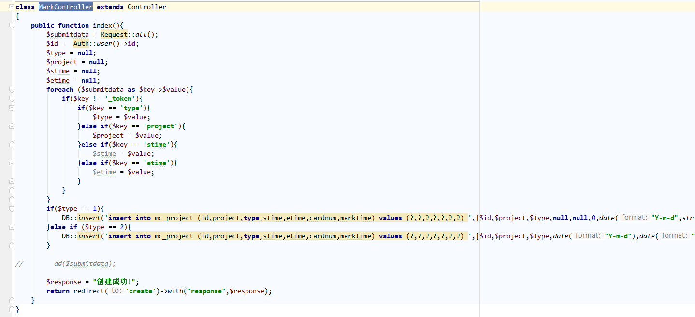

概述
===

随着城市快节奏的发展，项目多、重高效的工作、生活状态促使越来越多人倾向于选择计划性、自律性的生活方式。人们通过自制计划表、勾选任务栏等形式来记录自己一天的工作、生活足迹。然而手工制作表项、填涂选框总是费时且麻烦的，而且有时也会试着把每天的计划偷工减料，更重要的是每天一张纸的开销也不利于环保。“魔卡”应用旨在抛弃传统的记手账模式，简洁易上手的操作界面让用户轻松打卡，即刻生成当天的打卡报表，用户可以随时查看自己当天所完成的任务和相应历史完成次数。当日所有任务按用户自定义计划完成时，“魔卡”会提示用户今日任务已全部完成，激发用户完成任务的成就感，如果用户在某天还没有打卡，“魔卡”也会严格的发出提醒。极具特色的是，“魔卡”十分“严苛地”维护历史数据，用户一旦新建某项任务，该任务就必须每天都要完成，这将准确服务于容易偷工减料、半途而废的用户，帮助其在严格的任务管理中实现自我约束。

目的和用途
===
“魔卡”希望能让用户爱上有计划、有总结、环保的打卡方式。用户可以用“魔卡”来自定义当天计划，当用户需要打卡时，只需要轻松一键便可勾选任务完成一次打卡；用户可以用“魔卡”来查看当前计划完成进度，进度达到百分之百时，用户将得到“今日任务已全部完成”的提示；用户可以用“魔卡”来实现自我约束，每个任务一旦被创建，用户将确保自己每天都完成一次，“魔卡”更像是一位严格的教练，监督着用户完成自己最初的规划。

需求说明
===

业务需求
---

### 新建任务
用户对当天需要完成的任务有增加需要时，可以创建一个新的任务。注意从此以后的每一天，用户都需要完成这项任务的打卡，不可中途放弃，否则视为当天任务没有完成。
### 任务打卡
用户可以通过当日的任务完成情况对其相应的任务进行打卡，当勾选已完成的打卡任务后并提交打卡数据，系统会自动统计打卡的信息并反馈给用户。
### 今日报表
用户通过查看今日报表可以了解到当天的任务完成情况。具体来说，当某项任务今天已完成时，可以看到该任务的历史已完成次数。当所有任务都达到计划要求时，判定今日任务已全部完成。另外，如果今日还没有开始打卡，用户将得到待打卡的提醒。
### 个人中心
用户的所有注册信息都可以在个人中心找到。包括账户、邮箱、注册日等个人信息。

非功能性需求
---

### 时间特性要求
每天的任务报表在凌晨将定时清空重置，具体来说，每项任务的勾选框将出现在界面中，用以服务用户新的一天打卡。
### 灵活性要求
用户当天有增加新任务的要求时，可以允许用户新建当前未被创建的任务，如果该任务是已被创建过的，用户将得到新建无效的提示。
### 数据管理能力要求
数据库需要维护每项任务已完成的历史次数，实现每次打卡后的次数累加，当有新任务被创建时，一个新的表项也要对应生成。

环境要求
---

Win10 或 Linux  php5.6+  Apache  mysql

系统分析与设计
===

系统分析
---

### 数据流图

### 系统IPO图：

### Use Case图

### 设计类图

### 通信图（协作图）

### 活动图

### 数据库ER图：

系统设计
---

### 系统结构图设计

### 数据库数据字典设计
mc_users：储存用户信息，主键为（id,email），包含用户id、姓名、邮箱、密码、标志值、创建日期，更新日期8个字段

mc_project：存储用户任务信息，主键为（id,project）,外键为id，包含用户id，项目、类型、任务起始时间、任务结束时间、打卡次数、打卡时间

模块/函数设计
---

### 个人中心数据处理模块

UserController类中的Index方法直接调用Auth类中存储的用户ID到数据库中取得对应用户的资料封装到参数 $data 中传给前端处理。
流程图：

###  今日报表数据处理模块

FormController类中的index方法用Request:all()获取前端表单打卡提交的数据，并根据请求的信息处理数据（从数据库中取数据）封装到 $return_data 变量中传给前端。
流程图：

### 创建任务数据处理模块

MarkController类index方法用Request:all()获取前端表单创建任务提交的数据，处理提交的数据后将任务表单更新到数据库的project表中，更新成功后将 $response 创建成功的信息返回给前端。
流程图：

系统实现
===

关键模块/函数的实现
---

### UserController模块，用户资料模块通过index方法将个人用户信息返回给前端。

### FormController模块，对应用户ID的项目信息通过index方法从数据库中取得数据后，经处理，返回给前端。

### MarkController模块，处理用户新建项目。Index方法对提交的表单数据进行处理后更新到数据库中，并返回提示信息。

